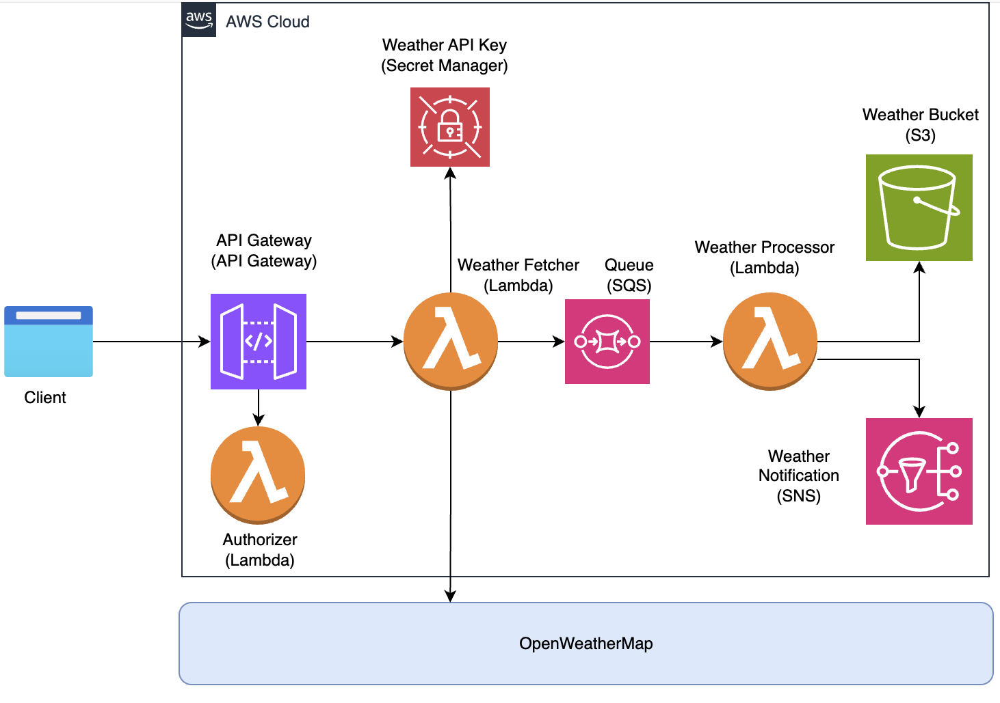

## Serverless Weather Notification System 

This repository contains GitHub Actions workflows to deploy Serverless Weather Notification System on AWS.

### Architecture Overview



This architecture illustrates a serverless weather notification system deployed on AWS Cloud. It leverages various AWS services to fetch weather data, process it asynchronously, store it, and notify users.

### Components and Workflow
#### 1. Client Interaction
- The client initiates a request through an **API Gateway**.
- The request is authenticated using a **Lambda Authorizer**, which validates access using simple JWT tokens.

#### 2. Weather Data Retrieval
- Upon authorization, the request is routed to the **Weather Fetcher Lambda** function.
- This function retrieves the **OpenWeatherMap API Key** from **AWS Secrets Manager**.
- It then sends a request to **OpenWeatherMap** API to get real-time weather data.

#### 3. Weather Processing
- Fetched data is sent to an **SQS Queue** to enable decoupled and scalable processing.
- A separate **Weather Processor Lambda** function is triggered by new messages in the queue.

#### 4. Data Storage & Notification
- The **Weather Processor Lambda** stores the processed data in an **Amazon S3 bucket** (Weather Bucket).
- It also publishes relevant weather updates to **Amazon SNS** for sending notifications (email or SMS).


### Setup Instructions

1. **Fork/Clone this repository**

2. **Set up GitHub Secrets** (Repository Settings > Secrets and variables > Actions > Create Environment Secret for environment i.e., dev, staging, prod ):
   ```
   AWS_ACCESS_KEY_ID: Your AWS access key
   AWS_SECRET_ACCESS_KEY: Your AWS secret key
   WEATHER_API_KEY: Your OpenWeatherMap API key
   ```

3. **Configure Terraform Backend** (Optional but recommended):
    - In the GitHub Repository, Navigate to Actions > Run workflow ***Deploy AWS S3 to manage terraform state***

5. **Deploy the main infrastructure for the system**
    - In the GitHub Repository, Navigate to Actions > Run workflow ***Deploy AWS Weather Infrastructure***

5. **Deploy AWS Lambda functions code**
    - In the GitHub Repository, Navigate to Actions > Run workflow ***Deploy Lambda Functions***
   
6. **Import Postman Collection for testing**
    - Open Postman and import the collection from src/postman/weather_notification.postman_collection.json

7. **Create Postman new environment and environment variables**
    ```
       API_GATEWAY_URL: Get it from AWS Console > API Gateway > Stages > POST method > Invocation URL
       EMAIL: Your test email
       PHONE_NUMBER: Your test phone number
    ```
8. **Clean up the system**
   - Once you finish system verification, you can clean it up by navigating to the GitHub Repository > Actions > Run workflow ***Cleanup AWS Resources***

### API usage instructions

1. **Once the Postman collection is imported and Postman environment variables are created as described before. The following requests can be tested**
   - weather-without-notification
   - weather-sms-notification
   - weather-email-notification
   - weather-both-notification
   - weather-missing-city_name
   - weather-missing-country_code
   
### Project Structure
   **The project directory structure is as below:**:
   ```
   project-root/
   ├── .github/workflows/
   ├── infrastructure/
   ├── s3setup/
   ├── src/
   │   └── lambda/
   │       └── authorizer/   
   │       ├── tests/
   │       ├── weather-fetcher/
   │       └── weather-processor/
   │   └── postman/
   │── architectural-diagram.png 
   └── README.md
   ```
   - **GitHub Actions workflows are located in the .github/workflows folder**

   - **Terraform for the main infrastructure is located in the infrastructure folder**

   - **Terraform for terraform state management is located in the s3setup folder**

   - **Python code for Lamda functions is located in the src/lambda folder**

   - **Unit test cases are located in the src/lambda/tests folder:**:

### Monitoring

- CloudWatch Logs for each Lambda function
- SNS notifications (email or SMS)
- S3 bucket contains processed weather data organized by date

### Assumptions and limitations

1. Identity Provider integration is out of scope. With the current implementation, the valid tokens are ***valid-JWT-001'*** and ***valid-JWT-002'***,
2. To allow notification configurable, the request structure is as below

   | Element Name | Data type | Cardinality | Description                                        |
   |----------|----------|-------------|----------------------------------------------------|
   | city_name | String   | Mandatory   | City name. i.e., London, Melbourne                 |
   | country_code | String  | Mandatry    | Country code. i.e., UK, AU, US                     |
   | notification_type   | String   | Optional    | Notification type can be either sms, email or both |
   | phone_number   | String   | Optional    | Phone number in valid format i.e., +61412345678    |
   | email   | String   | Optional | Email address                                      |

2. S3 is sufficient for the storage requirement. If it requires to store in a database, the code can be extended to meet the requirement.
3. GitHub Actions Environment Secrets provide a reasonable and secure way to store keys for the current scope. However, integrating with HashiCorp Vault may be a more robust and scalable option in the future when time and resources allow for its implementation.
4. For email notifications, the initial request may not result in email delivery if the recipient's email address has not yet been confirmed. Once the email address is verified, subsequent requests will be delivered successfully.
5. Due to time constraints, the notification unsubscribe feature has not been implemented yet 

### Architechtal Desicion
1. Language Selection – Python over Java
   - ***Decision***: Python is chosen as the implementation language for AWS Lambda functions instead of Java. Python is select over Java with the justification that python has faster cold start time
   - ***Justification***: Python offers significantly faster cold start times compared to Java in AWS Lambda environments. This is especially important for event-driven, user-facing workloads where latency sensitivity is critical. Faster cold starts help reduce response time and improve overall user experience. Additionally, Python's concise syntax and rich ecosystem make it well-suited for rapid development and integration with AWS services.

